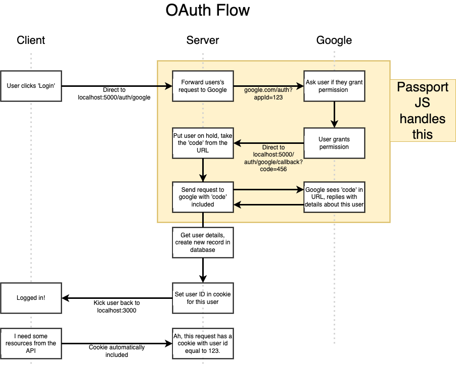

## About The Project

- Node with React: Fullstack Web Development
- Build and deploy fullstack web apps with NodeJS, React, Redux, Express, and MongoDB.
- Tutorial for Emaily
- [Stephen Grider](https://github.com/StephenGrider)

&nbsp;

## Notes

### App Overview

- Someone uses startup owner's app/service
- Startup owner wants feedback
- Send customer an email requesting feedback
- Get tabulation of results
- Make app/service better with feedback

&nbsp;

### App User Flow & Tech Stack

- User signs up via Google OAuth (Express server + MongoDB + PassportJS)
- User pays for email credits via stripe (Stripe + MongoDB)
- User creates a new 'campaign' (React + Redux)
- User enters list of emails to send survey to (React + Redux + Redux Form)
- We send email to list of surveyees (Email Provider)
- Surveyees click on link in email to provide feedback (Email Provider + Express + MongoDB)
- We tabulate feedback (MongoDB?)
- User can see report of all survey responses (Mongo + React + Redux)

&nbsp;

### Deployment Checklist

- Dynamic Port Binding
- Specify Node Environment
- Specify Start Script
- Create .gitignore file

&nbsp;

### OAuth Flow

- <u>Password Library Components</u>
  - passport: General helpers for handling auth in Express apps
  - passport strategy: [List of Strategies](https://github.com/jaredhanson/passport/wiki/Strategies)

- [Using OAuth 2.0 to Access Google APIs](https://developers.google.com/identity/protocols/oauth2)
- [Setting up OAuth 2.0](https://support.google.com/cloud/answer/6158849)
  1. Go to the Google Cloud Platform Console
  2. Create new project
  3. Create credentials
  4. <b>User consent:</b> OAuth consent screen
  5. <b>Authorized domains:</b> Not setup in this tutorial (Require hosting domain)
  6. <b>Web applications</b>
     - <b>JavaScript origins:</b> <code>http://localhost:3000</code>
     - <b>Authorized redirect URIs:</b> <code>http://localhost:3000/auth/google/callback</code>

&nbsp;
