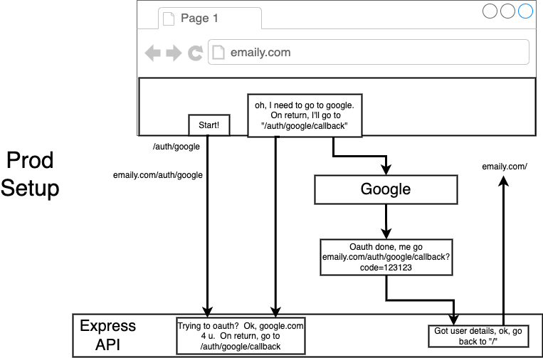

## About The Project

- Node with React: Fullstack Web Development
- Build and deploy fullstack web apps with NodeJS, React, Redux, Express, and MongoDB.
- Tutorial for Emaily
- [Original Repo: Emaily](https://github.com/StephenGrider/FullstackReactCode)
- [Stephen Grider](https://github.com/StephenGrider)

&nbsp;

## Notes

### App Overview

- Someone uses startup owner's app/service
- Startup owner wants feedback
- Send customer an email requesting feedback
- Get tabulation of results
- Make app/service better with feedback

&nbsp;

### App User Flow & Tech Stack

- User signs up via Google OAuth (Express server + MongoDB + PassportJS)
- User pays for email credits via stripe (Stripe + MongoDB)
- User creates a new 'campaign' (React + Redux)
- User enters list of emails to send survey to (React + Redux + Redux Form)
- We send email to list of surveyees (Email Provider)
- Surveyees click on link in email to provide feedback (Email Provider + Express + MongoDB)
- We tabulate feedback (MongoDB?)
- User can see report of all survey responses (Mongo + React + Redux)

&nbsp;

### Deployment Checklist

- Dynamic Port Binding
- Specify Node Environment
- Specify Start Script
- Create .gitignore file

&nbsp;

### OAuth Flow

- <u>Password Library Components</u>
  - passport: General helpers for handling auth in Express apps
  - passport strategy: [List of Strategies](https://github.com/jaredhanson/passport/wiki/Strategies)

- [What's the difference between OpenID and OAuth?](https://stackoverflow.com/questions/1087031/whats-the-difference-between-openid-and-oauth)
- [Using OAuth 2.0 to Access Google APIs](https://developers.google.com/identity/protocols/oauth2)
- [Setting up OAuth 2.0](https://support.google.com/cloud/answer/6158849)
  1. Go to the Google Cloud Platform Console
  2. Create new project
  3. Create credentials
  4. <b>User consent:</b> OAuth consent screen
  5. <b>Authorized domains:</b> Not setup in this tutorial (Require hosting domain)
  6. <b>Web applications</b>
     - <b>JavaScript origins:</b>
       - <code>http://localhost:3000</code>
       - <code>http://localhost:4000</code>
       - <code>https://emaily-30-mar-2022.herokuapp.com</code>
     - <b>Authorized redirect URIs:</b>
       - <code>http://localhost:3000/auth/google/callback</code>
       - <code>http://localhost:4000/auth/google/callback</code>
       - <code>https://emaily-30-mar-2022.herokuapp.com/auth/google/callback</code>

- HTTP is stateless

&nbsp;

---

&nbsp;

> <b>Balaji:</b> Cookie vs JWT

> <b>Bobby:</b> I will share Stephen's previous response on this:

> "Cookies vs JWT's are two very different things that do not serve the same purpose.

> Cookies are a transport mechanism. It is a piece of data that is managed automatically by the browser, and gets added on to every request issued to a server at some particular domain. Although they are native to the browser, mobile apps, desktop apps, etc can use cookies as well.

> JWT's are an authentication mechanism. It is a token that encodes some piece of information. To be clear, cookies are a tool to move data around. JWT's are a tool to store some information. They don't serve the same purpose.

> With all this said, the auth setup in the course very closely mimics exactly what a JWT does. The course shows how to store some encoded piece of information in a string via the cookie-session library. This encoded string has some information that identifies the user. Although we only store the user's ID in that string, we could just as easily add in some more information, such as the user's email address, full name, etc. A JWT functions in the same way - we can store some information in it."

&nbsp;

---

&nbsp;

> <b>Taylor:</b> Why not JWT?

> <b>Stephen:</b> Using JWT's in the header of each request in the other course was a result of putting the react app on one domain and the API server on a different one. In a few lectures we dive really deep into talking about why the server setup in this course makes working with cookies possible. One of the nasty things around JWT's is that there isn't a great place to store them on the client side - they are almost always weak against XSS attacks. Using cookies solves that huge huge issue.

> I have many other thoughts about this, but for right now might be best if you check out that other lecture to talk more about CORS and how cookies works with em.

&nbsp;

---

&nbsp;

- [Cookie Size: 4096 bytes](https://chromestatus.com/feature/4946713618939904)
- [Production Best Practices: Security](https://expressjs.com/en/advanced/best-practice-security.html)

> <b>Mohammed:</b> As Stephen mentioned that using Cookie Session we store all of the data into the cookie rather than Express session where all of data is stored inside the cookie. So my question is does Cookie Session essentially mean the same as using JWT Token where all of the data is passed inside the token? If not how are they both different?

> <b>Maeva:</b> Yes, cookies are basically doing the same thing as JWT tokens. The main differences are:

> - Cookies are automatically sent back and forth in the HTTP request header. Coders don't have to manually set them, the browser automatically does the management. JWT must be programmatically set by you the coder in each requests.
> - Cookies only work in browsers. JWT can work both in browsers and other platforms (e.g. mobile apps)
> - Cookies have been used since forever (stood the test of time). JWT is a rather new technology that came with the rise of the mobile platform and its crossover with web technology.
> - JWT payload are not necessarily encrypted (It's mostly using base64 encoding and some signature) There are still ongoing debate over the security of JWT.

&nbsp;

---

&nbsp;

> <b>Sayan:</b> On <code>req.logout()</code>, the user is no longer attached to the req object. But when I go to the browser dev tools and open the Application tab, I can still see the cookie with session info in it. Shouldn't logout clear the cookie as well? What am I missing here?

> <b>Mehdi:</b> Hello, logout doesnt 'clear' the cookie, it 'unests' the user from it, i think stephen did mention this in a video, i'm not sure which one but, when you are authentified the session object is set with an encrypted value that holds the userid, when you're logged out, the session's encrypted value is empty if that makes sense.

> To verify this you can try to check the content of the session while logged in & out, the value inside session should be much 'longer' when u're logged in as opposed to when u're logged out

&nbsp;

---

&nbsp;

### Multiple Strategies

- [passport.authorize()](http://www.passportjs.org/concepts/delegated-authorization/)

> <b>Joseph:</b> How would you (or I) handle the use case where someone would be logging in with multiple Auths? How would we prevent the strategy from searching the db and creating an unnecessary new User in the case that they had auth'd with Google and now are auth'ing with IG?

> <b>Stephen:</b> Hi Guys - Only way to handle this is to store the email given to you by the provider. Remember that with google, in the profile object we got a list of the user emails. We could store that list, then whenever someone signs in with another provider, check to see if that provider's emails have been used before from another provider. Confusing when I put it in words, but I bet you get it.

> The thing to keep in mind is that this opens you up to account highjacking. For example, imagine the following:

> - Bill signs up to our service with Google. Bill's google profile shows an email of bill@gmail.com.
> - Hacker Jill then creates an account on Instagram and enters a fake email address of bill@gmail.com.
> - Hacker Jill then comes to our site and tries to oauth through instagram.
> - Our server might see the instagram profile email of bill@gmail.com, and - unless we guard against it - we might incorrectly link bill's account with this new instagram oauth.

> To guard against this, do the following:

> - Bill signs up with Google, and we create a new account that contains an email of bill@gmail.com.
> - Bill logs out, then comes back to our site and attempts to oauth with Instagram. Let's imagine that instagram also lists bill@gmail.com.
> - We must detect that Bill already has an account tied to google.
> - After detecting that Bill already has a user account, we will only allow Bill to auth through Instagram and link this account if Bill is signed in with Google.
> - In other words, only allow account linking if the user is already signed in with the other account. That proves that Bill is who they say they are and that both the Instagram and Google accounts belong to him.
> - I know this sounds hard, but it isn't as bad as it sounds. To pull it off, every use model record store the the list of emails from each provider that the user auths with. Then, in each strategy you wire up, check to see if the user's email is already in use. If it is, check to see if the user is logged in (by looking at req.user). If they are, allow them to pass, otherwise tell them the email is in use and that they should go sign in with the other oauth provider first.

&nbsp;

---

&nbsp;

### Heroku Proxy Issue

- <b>Option 1:</b> set <code>GoogleStrategy({callbackURL: ...})</code> in full to include https
- <b>Option 2:</b> Use a proxy

> <b>Jeffrey:</b> In case anyone else is left curious as to how the <code>proxy: true</code> option works, I didn't find any documentation on the option itself, but I found the code that makes it work. I'd like to share what I learned in case someone else is curious.

> Of course, an understanding of how it works requires an understanding of the problem. So I'll start there: When using Heroku's deployment system, our browser doesn't connect directly to the machine which hosts our server. It actually connects to one of Heroku's load-balancers (or "proxy"). That load-balancer then connects to the machine with our server, and ultimately forwards our request.

> Even if we use https when we connect to the load-balancer, the load-balancer is free to forward using "http", which is what it's doing. The problem is that while we connect to the load-balancer using "https", the load-balancer forwards our request using "http".

> That means that our server is never receiving an "https" request. The server receives an "http" request, which, combined with our relative <code>callbackURL</code> in the <code>GoogleStrategy</code> options, is what is used to build the callback URL. Because the callback URL is now an "http" URL it no longer matches the "https" we have listed as allowable in the Google console, and we get our error.

> The fix is to somehow tell the server "Hey, this request was actually forwarded by a proxy, I want you to ignore the proxy's protocol and use the original sender's protocol, which is https".

> Our mechanism for doing this is <code>proxy: true</code>, which works by leveraging a non-standard (but widely used and accepted) header called <code>X-Forwarded-Proto</code> to determine the original request's protocol. In this case, even though Heroku's load-balancer is forwarding using http, it also saves the original protocol's request ("https") using the <code>X-Forwarded-Proto</code> header.

> When we set <code>proxy</code> to <code>true</code>, it tells our server to check if there is an <code>X-Forwarded-Proto</code> header in the request, and use the protocol stored there instead of whatever protocol the actual request used.

> Interestingly, the strategy library we are using in the course (<code>passport-google-oauth2</code>) doesn't make any mention of a <code>proxy</code> option. However, by following the code we find that the function/class we ultimately end up importing via <code>require('passport-google-oauth2')</code> inherits from a more generic strategy library, called <code>passport-oauth2</code> ([See code here](https://github.com/jaredhanson/passport-google-oauth2/blob/723e8f3e8e711275f89e0163e2c77cfebae33f25/lib/strategy.js#L65))

> In <code>passport-oauth2</code> we see that the <code>proxy</code> option is read from our supplied <code>options</code> into <code>this.\_trustProxy</code> ([code here](https://github.com/jaredhanson/passport-oauth2/blob/1ac8cbba5aef89845c959d543a248bbb647105c2/lib/strategy.js#L114)) and later passed to a function called <code>originalURL</code> where it is used to rebuild the callback URL ([code here](https://github.com/jaredhanson/passport-oauth2/blob/1ac8cbba5aef89845c959d543a248bbb647105c2/lib/strategy.js#L147)).

> Inside <code>originalURL</code>, we see that it reads from the <code>X-Forwarded-Proto</code> header, if found, and uses it's contents instead of "http".

> I also noticed that the library will honor an Express setting called <code>trust proxy</code>. Instead of using <code>proxy: true</code> in the options, we can also use a global express setting to achieve the same result. You can try it by commenting out proxy: true and adding the following right after <code>const app = express();</code> in <code>index.js: app.set('trust proxy', true);</code>

> One benefit I can think of to this method vs using <code>proxy: true</code> is that we would have a single place to enable/disable the setting when using multiple auth strategies. For example, instead of adding similar <code>proxy: true</code> settings to each of google, facebook, and github login options, we would simply add or remove the <code>trust proxy</code> setting for express. This assumes the other Strategies also honor the setting.

> For more info about Express' trust proxy behavior read ([here](https://expressjs.com/en/api.html#trust.proxy.options.table)) and ([here](http://expressjs.com/en/guide/behind-proxies.html)).

&nbsp;

---

&nbsp;

### Create React App Proxy Issue

- [Proxying API Requests in Development](https://create-react-app.dev/docs/proxying-api-requests-in-development/)

> <b>Bobby:</b> React doesn't have a server, however, the tool we used to set up our environment - Create React App, provides us with the use of a Webpack Dev Server to transpile and build our code on the fly. This how we get our live updating when we make code changes. It is only meant for development, not production. In production, we need to build our static React assets and then have Express serve them and handle requests from users etc.

> <b>Azteker:</b> Why cannot we make the dev mode the way like prod mode? Why do we have to use react server in dev mode?

> <b>Bobby:</b> In production the only thing that exists of the client side is a bundle.js asset file which is the transpiled minified version of all the code. Without CRA you would have to manually generate this asset every single time a change was made to the project, which would not be reasonable.

&nbsp;

---

&nbsp;

### Redux

- The existing <code>connect</code> API still works and will continue to be supported, but the hooks API is simpler and works better with TypeScript.
- [What is the main difference between using React-Redux Hooks and React-Redux Connect()?](https://stackoverflow.com/questions/58027300/what-is-the-main-difference-between-using-react-redux-hooks-and-react-redux-conn)

> <b>Enrique:</b> Why don't use the redux-promise middleware? What's the differences?

> <b>Faraaz:</b> Redux Thunk allows your action creators to return a function instead of returning an action object. This function gives you access to the dispatch function, and allows you to dispatch multiple actions as you please. You can dispatch actions when certain conditions are met. Redux Promise on the other hand, allows your action creators to return a promise as the payload. You can use both Redux Thunk and Redux Promise in your applications based on the situation. If there is a lot of complexity or a need for conditonals, Redux Thunk is the way to go. But let's say you have multiple promises and also have the need for conditionals at the same time, you will be using both.

> <b>Torleif:</b> I see several people putting out code here to handle logging out on the client side via redux etc.

> Be aware that none of them (at least the ones I've seen so far) seem to care about other data loaded into the store. Clearing the auth store tells the app that the user is logged out, yes, but if a user has been logged in, there will be other data loaded in the store. For this app specifically, you'll (eventually) have surveys belonging to the user, status of purchased in-app currency, etc.

> These things should also be cleared out. And a very safe and easy way to do that, is a full browser refresh/redirect.

> If you don't do a full refresh/redirect, you might be setting yourself up for accidental leaking of personal data...

> It might be unlikely that someone gets access to personal data this way, but it is possible, and it's better to be safe than sorry...

&nbsp;

---

&nbsp;

### Billing

- Never accept raw credit card numbers
- Never store credit card numbers
- Always use an outside payment processor
- Possible to avoid monthly payments/multiple plans?
- Fraud and chargebacks are a pain

> <b>Randy:</b> His suggestion is more in line with the scenario that you actually described where the credits cost a set prices. In your example, you mention 50 or 100 surveys and this would still fall under the same pricing structure as spending $1 for 1 credit as no Monthly SUBSCRIPTION is being introduced into the billing process, just pay once in the transaction for the desired amount of credits/surveys ($50 for 50 surveys or $100 for 100 surveys).

> Lets say you did want to offer a subscription service for the example you gave with the user switching from a 50 survey plan to a 100 survey plan in the middle of the cycle. Would it make more sense to go through the trouble of building all of the logic involved just to give the difference or would it be easier for them to initiate another transaction in the manner that Stephen is suggesting? Either way, they will come away with the same number of desired surveys/credits (assuming they are still $1 per credit in your subscription plans).

> I see it as Stephen giving us a clear heads-up/warning about the pitfalls of overcomplicating something that is already hard and sometimes it's best to keep it simple and don't give your users/customers any means cause a fuss or become confused about pricing or plan upgrades. Hopefully this helps!

- User clicks 'Add Credits'
- Tell Stripe to show a credit card form
- User enters credit card details
- Details sent directly from the form to Stripe
- Stripe sends back a token representing the charge
- We send token to our API
- Our API confirms the charge was successful with Stripe
- Add credits to user's account

&nbsp;

---

&nbsp;

### Stripe & Environment Variables

- [Stripe - checkout](https://stripe.com/docs/checkout/quickstart)
- [Adding Custom Environment Variables](https://create-react-app.dev/docs/adding-custom-environment-variables/)
- [Why we commit .env for client side.](https://github.com/facebookincubator/create-react-app/issues/2403)

&nbsp;

### Routing in Production & Build client for Heroku

- [What's the difference between path.resolve and path.join?](https://stackoverflow.com/questions/35048686/whats-the-difference-between-path-resolve-and-path-join)

- <b>Deployment Options:</b>
- <b>Option 1:</b>
  - Build client project
  - Commit built project
  - Push to Heroku
- <b>Option 2:</b>
  - Push to Heroku
  - Tell Heroku to install _all_ dependencies for client project
  - [Heroku Nodejs Support](https://devcenter.heroku.com/articles/nodejs-support)
- <b>Option 3:</b>
  - Push to Continuous Integration (CI)
  - Run tests and stuff
  - CI builds and commits client
  - CI pushes build to Heroku
  - [Heroku CI](https://devcenter.heroku.com/articles/heroku-ci)
  - [circleci](https://circleci.com/)

> <b>Jordan:</b> In lecture 119 we set <code>NPM_CONFIG_PRODUCTION=false</code> which installs the dev dependencies on the client-side. Why do we need dev dependencies? I thought the whole point of dev dependencies is that you don't need them when your app is deployed.

> <b>Bobby:</b> Heroku used to set NPM_CONFIG_PRODUCTION to true by default (this is no longer the case), which meant that the devDependencies would get ignored entirely. Create React App used to install the react-scripts to the devDependencies of the package.json. The react-scripts are required in order to run the build step that generates the static React bundle during Heroku's post-build step. So, Heroku would not have been able to run the build step prior to deployment since those files would have been missing.

> Again, since CRA now installs to the dependencies of the package.json, this is not really of concern. However, if you had instead manually built your own toolchain and included these files in the devDependencies, then the NPM_CONFIG_PRODUCTION would have some importance.

&nbsp;

---

&nbsp;

### Survey

- Our user creates a survey with a simple 'yes/no' question
- Express server creates an email template
- Use 3rd party email provider to send email
- End user clicks 'yes' or 'no' response
- Email provider notes response
- Email provider sends note to our Express server
- Express server records feedback in Mongo

- [MongoDB Limits and Thresholds](https://docs.mongodb.com/manual/reference/limits/)

> <b>Adam:</b> Is there any particular reason we don't have to create a new recipientSchema object for each email, e.g:

> <code>recipients: recipients.split(',').map(email => new Recipient({ email })) </code>

> Instead we pass in a plain object that conforms to the schema, but isn't an instance of the Recipient model. I'm guessing Mongoose does that behind the scenes? Otherwise, how would the responded property in the schema be created with its default value?

> <b>Andrew:</b> Late response but when we defined the survey schema we set it to expect an array of recipient objects so mongoose knows that the objects in the array are supposed to be an instance of the recipient model class. Since we pass in the email property and the responded property has a default value, the objects in the array will match all of the necessary criteria for recipient schema.

&nbsp;

---

&nbsp;

> <b>Shay:</b> How does user (e.g req.user) is defined everywhere?

> <b>Bobby:</b> That's the problem, you are looking for an exact place req.user is being set in our code. You will not find it, because this is being set under the hood by our passport middleware. That was the point Stephen was making in his comment:

> "Its coming from Passport, specifically from the 'app.use(passport())' middleware. Here's the source code from what that 'passport()' call is doing: https://github.com/jaredhanson/passport/blob/master/lib/middleware/authenticate.js#L244. Line 244 is where 'req.user' is set. You can read the comments in this file to get a better picture of what is going on, too."

> The source code tries to address this and make this clear:

- Applies the `name`ed strategy (or strategies) to the incoming request, in order to authenticate the request. If authentication is successful, the user will be logged in and populated at `req.user` and a session will be established by default. If authentication fails, an unauthorized response will be sent.

&nbsp;

---

&nbsp;

> <b>Pavel:</b> Somewere along the way i forgot how does req get the hold of the user obj.

> <b>Jimmy:</b> CookieParser Middleware intercepts session passes the data to Passport Middleware passes the data to req.user. Services/Passport.js has all the code that serialises and deserialises the user data into the request object that you use in the app routes.

&nbsp;

---

&nbsp;

- Create new Survey instance
- Attempt to create and send email
- Email sent successfully?
- Save survey!
- Survey handler complete

- We tell Sendgrid to send an email
- Sendgrid scans the email, replaces every link with their own special one
  - Sendgrid knows who the recipient of every email is! The links they inject into the email contains a token that identifies the user!
- User clicks a link
- Sendgrid knows who clicked it!
  - User sent to their destination
    - User happy
  - Sendgrid sends a message to our telling us about the click

&nbsp;
